# Building PES-VCS — A Version Control System from Scratch

**Student:** Ananya | **SRN:** PES2UG24CS059  
**Platform:** Ubuntu 22.04  
**Objective:** Build a local version control system that tracks file changes, stores snapshots efficiently, and supports commit history. Every component maps directly to operating system and filesystem concepts.

---

## Table of Contents

- [Getting Started](#getting-started)
- [Understanding Git: What You're Building](#understanding-git-what-youre-building)
- [What You'll Build](#what-youll-build)
- [Phase 1: Object Storage Foundation](#phase-1-object-storage-foundation)
- [Phase 2: Tree Objects](#phase-2-tree-objects)
- [Phase 3: The Index (Staging Area)](#phase-3-the-index-staging-area)
- [Phase 4: Commits and History](#phase-4-commits-and-history)
- [Phase 5 & 6: Analysis Questions](#phase-5--6-analysis-only-questions)
- [Submission Checklist](#submission-checklist)
- [Submission Requirements](#submission-requirements)
- [Further Reading](#further-reading)

---

## Getting Started

### Prerequisites

```bash
sudo apt update && sudo apt install -y gcc build-essential libssl-dev
```

### Using This Repository

This is a **template repository**. Do **not** fork it.

1. Click **"Use this template"** → **"Create a new repository"** on GitHub
2. Name your repository (e.g., `SRN-pes-vcs`) and set it to **public**. Replace `SRN` with your actual SRN, e.g., `PESXUG24CSYYY-pes-vcs`
3. Clone this repository to your local machine and do all your lab work inside this directory.
4. **Important:** Remember to commit frequently as you progress. You are required to have a minimum of 5 detailed commits per phase.
5. Clone your new repository and start working

The repository contains skeleton source files with `// TODO` markers where you need to write code. Functions marked `// PROVIDED` are complete — do not modify them.

### Building

```bash
make          # Build the pes binary
make all      # Build pes + test binaries
make clean    # Remove all build artifacts
```

### Author Configuration

PES-VCS reads the author name from the `PES_AUTHOR` environment variable:

```bash
export PES_AUTHOR="Your Name <PESXUG24CS042>"
```

If unset, it defaults to `"PES User <pes@localhost>"`.

### File Inventory

| File | Role | Your Task |
|------|------|-----------|
| `pes.h` | Core data structures and constants | Do not modify |
| `object.c` | Content-addressable object store | Implement `object_write`, `object_read` |
| `tree.h` | Tree object interface | Do not modify |
| `tree.c` | Tree serialization and construction | Implement `tree_from_index` |
| `index.h` | Staging area interface | Do not modify |
| `index.c` | Staging area (text-based index file) | Implement `index_load`, `index_save`, `index_add` |
| `commit.h` | Commit object interface | Do not modify |
| `commit.c` | Commit creation and history | Implement `commit_create` |
| `pes.c` | CLI entry point and command dispatch | Do not modify |
| `test_objects.c` | Phase 1 test program | Do not modify |
| `test_tree.c` | Phase 2 test program | Do not modify |
| `test_sequence.sh` | End-to-end integration test | Do not modify |
| `Makefile` | Build system | Do not modify |

---

## Understanding Git: What You're Building

Before writing code, understand how Git works under the hood. Git is a content-addressable filesystem with a few clever data structures on top. Everything in this lab is based on Git's real design.

### The Big Picture

When you run `git commit`, Git doesn't store "changes" or "diffs." It stores **complete snapshots** of your entire project. Git uses two tricks to make this efficient:

1. **Content-addressable storage:** Every file is stored by the SHA hash of its contents. Same content = same hash = stored only once.
2. **Tree structures:** Directories are stored as "tree" objects that point to file contents, so unchanged files are just pointers to existing data.

```
Your project at commit A:          Your project at commit B:
                                   (only README changed)

    root/                              root/
    ├── README.md  ─────┐              ├── README.md  ─────┐
    ├── src/            │              ├── src/            │
    │   └── main.c ─────┼─┐            │   └── main.c ─────┼─┐
    └── Makefile ───────┼─┼─┐          └── Makefile ───────┼─┼─┐
                        │ │ │                              │ │ │
                        ▼ ▼ ▼                              ▼ ▼ ▼
    Object Store:       ┌─────────────────────────────────────────────┐
                        │  a1b2c3 (README v1)    ← only this is new   │
                        │  d4e5f6 (README v2)                         │
                        │  789abc (main.c)       ← shared by both!    │
                        │  fedcba (Makefile)     ← shared by both!    │
                        └─────────────────────────────────────────────┘
```

### The Three Object Types

#### 1. Blob (Binary Large Object)

A blob is just file contents. No filename, no permissions — just the raw bytes.

```
blob 16\0Hello, World!\n
     ↑    ↑
     │    └── The actual file content
     └─────── Size in bytes
```

The blob is stored at a path determined by its SHA-256 hash. If two files have identical contents, they share one blob.

#### 2. Tree

A tree represents a directory. It's a list of entries, each pointing to a blob (file) or another tree (subdirectory).

```
100644 blob a1b2c3d4... README.md
100755 blob e5f6a7b8... build.sh        ← executable file
040000 tree 9c0d1e2f... src             ← subdirectory
       ↑    ↑           ↑
       │    │           └── name
       │    └── hash of the object
       └─────── mode (permissions + type)
```

Mode values:
- `100644` — regular file, not executable
- `100755` — regular file, executable
- `040000` — directory (tree)

#### 3. Commit

A commit ties everything together. It points to a tree (the project snapshot) and contains metadata.

```
tree 9c0d1e2f3a4b5c6d7e8f9a0b1c2d3e4f5a6b7c8d
parent a1b2c3d4e5f6a7b8c9d0e1f2a3b4c5d6e7f8a9b0
author Alice <alice@example.com> 1699900000
committer Alice <alice@example.com> 1699900000

Add new feature
```

The parent pointer creates a linked list of history:

```
    C3 ──────► C2 ──────► C1 ──────► (no parent)
    │          │          │
    ▼          ▼          ▼
  Tree3      Tree2      Tree1
```

### How Objects Connect

```
                    ┌─────────────────────────────────┐
                    │           COMMIT                │
                    │  tree: 7a3f...                  │
                    │  parent: 4b2e...                │
                    │  author: Alice                  │
                    │  message: "Add feature"         │
                    └─────────────┬───────────────────┘
                                  │
                                  ▼
                    ┌─────────────────────────────────┐
                    │         TREE (root)             │
                    │  100644 blob f1a2... README.md  │
                    │  040000 tree 8b3c... src        │
                    │  100644 blob 9d4e... Makefile   │
                    └──────┬──────────┬───────────────┘
                           │          │
              ┌────────────┘          └────────────┐
              ▼                                    ▼
┌─────────────────────────┐          ┌─────────────────────────┐
│      TREE (src)         │          │     BLOB (README.md)    │
│ 100644 blob a5f6 main.c │          │  # My Project           │
└───────────┬─────────────┘          └─────────────────────────┘
            ▼
       ┌────────┐
       │ BLOB   │
       │main.c  │
       └────────┘
```

### References and HEAD

References are files that map human-readable names to commit hashes:

```
.pes/
├── HEAD                    # "ref: refs/heads/main"
└── refs/
    └── heads/
        └── main            # Contains: a1b2c3d4e5f6...
```

**HEAD** points to a branch name. The branch file contains the latest commit hash. When you commit:

1. Git creates the new commit object (pointing to parent)
2. Updates the branch file to contain the new commit's hash
3. HEAD still points to the branch, so it "follows" automatically

```
Before commit:                    After commit:

HEAD ─► main ─► C2 ─► C1         HEAD ─► main ─► C3 ─► C2 ─► C1
```

### The Index (Staging Area)

The index is the "preparation area" for the next commit. It tracks which files are staged.

```
Working Directory          Index               Repository (HEAD)
─────────────────         ─────────           ─────────────────
README.md (modified) ──── pes add ──► README.md (staged)
src/main.c                            src/main.c          ──► Last commit's
Makefile                               Makefile                snapshot
```

The workflow:
1. `pes add file.txt` → computes blob hash, stores blob, updates index
2. `pes commit -m "msg"` → builds tree from index, creates commit, updates branch ref

### Content-Addressable Storage

Objects are named by their content's hash:

```python
# Pseudocode
def store_object(content):
    hash = sha256(content)
    path = f".pes/objects/{hash[0:2]}/{hash[2:]}"
    write_file(path, content)
    return hash
```

This gives us:
- **Deduplication:** Identical files stored once
- **Integrity:** Hash verifies data isn't corrupted
- **Immutability:** Changing content = different hash = different object

Objects are sharded by the first two hex characters to avoid huge directories:

```
.pes/objects/
├── 2f/
│   └── 8a3b5c7d9e...
├── a1/
│   ├── 9c4e6f8a0b...
│   └── b2d4f6a8c0...
└── ff/
    └── 1234567890...
```

### Exploring a Real Git Repository

```bash
mkdir test-repo && cd test-repo && git init
echo "Hello" > hello.txt
git add hello.txt && git commit -m "First commit"

find .git/objects -type f          # See stored objects
git cat-file -t <hash>            # Show type: blob, tree, or commit
git cat-file -p <hash>            # Show contents
cat .git/HEAD                     # See what HEAD points to
cat .git/refs/heads/main          # See branch pointer
```

---

## What You'll Build

PES-VCS implements five commands across four phases:

```
pes init              Create .pes/ repository structure
pes add <file>...     Stage files (hash + update index)
pes status            Show modified/staged/untracked files
pes commit -m <msg>   Create commit from staged files
pes log               Walk and display commit history
```

The `.pes/` directory structure:

```
my_project/
├── .pes/
│   ├── objects/          # Content-addressable blob/tree/commit storage
│   │   ├── 2f/
│   │   │   └── 8a3b...   # Sharded by first 2 hex chars of hash
│   │   └── a1/
│   │       └── 9c4e...
│   ├── refs/
│   │   └── heads/
│   │       └── main      # Branch pointer (file containing commit hash)
│   ├── index             # Staging area (text file)
│   └── HEAD              # Current branch reference
└── (working directory files)
```

### Architecture Overview

```
┌───────────────────────────────────────────────────────────────┐
│                      WORKING DIRECTORY                        │
│                  (actual files you edit)                       │
└───────────────────────────────────────────────────────────────┘
                              │
                        pes add <file>
                              ▼
┌───────────────────────────────────────────────────────────────┐
│                           INDEX                               │
│                (staged changes, ready to commit)              │
│                100644 a1b2c3... src/main.c                    │
└───────────────────────────────────────────────────────────────┘
                              │
                       pes commit -m "msg"
                              ▼
┌───────────────────────────────────────────────────────────────┐
│                       OBJECT STORE                            │
│  ┌───────┐    ┌───────┐    ┌────────┐                         │
│  │ BLOB  │◄───│ TREE  │◄───│ COMMIT │                         │
│  │(file) │    │(dir)  │    │(snap)  │                         │
│  └───────┘    └───────┘    └────────┘                         │
│  Stored at: .pes/objects/XX/YYY...                            │
└───────────────────────────────────────────────────────────────┘
                              │
                              ▼
┌───────────────────────────────────────────────────────────────┐
│                           REFS                                │
│       .pes/refs/heads/main  →  commit hash                    │
│       .pes/HEAD             →  "ref: refs/heads/main"         │
└───────────────────────────────────────────────────────────────┘
```

---

## Phase 1: Object Storage Foundation

**Filesystem Concepts:** Content-addressable storage, directory sharding, atomic writes, hashing for integrity

**Files:** `pes.h` (read), `object.c` (implement `object_write` and `object_read`)

### What to Implement

Open `object.c`. Two functions are marked `// TODO`:

1. **`object_write`** — Stores data in the object store.
   - Prepends a type header (`"blob <size>\0"`, `"tree <size>\0"`, or `"commit <size>\0"`)
   - Computes SHA-256 of the full object (header + data)
   - Writes atomically using the temp-file-then-rename pattern
   - Shards into subdirectories by first 2 hex chars of hash

2. **`object_read`** — Retrieves and verifies data from the object store.
   - Reads the file, parses the header to extract type and size
   - **Verifies integrity** by recomputing the hash and comparing to the filename
   - Returns the data portion (after the `\0`)

Read the detailed step-by-step comments in `object.c` before starting.

### Testing

```bash
make test_objects
./test_objects
```

The test program verifies:
- Blob storage and retrieval (write, read back, compare)
- Deduplication (same content → same hash → stored once)
- Integrity checking (detects corrupted objects)

### Screenshots

**Screenshot 1A — `./test_objects` showing all tests passing:**

> 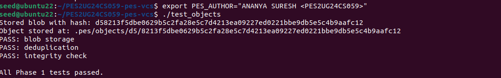

**Screenshot 1B — `find .pes/objects -type f` showing the sharded directory structure:**

> 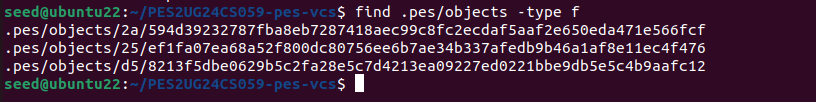
---

## Phase 2: Tree Objects

**Filesystem Concepts:** Directory representation, recursive structures, file modes and permissions

**Files:** `tree.h` (read), `tree.c` (implement all TODO functions)

### What to Implement

Open `tree.c`. Implement the function marked `// TODO`:

1. **`tree_from_index`** — Builds a tree hierarchy from the index.
   - Handles nested paths: `"src/main.c"` must create a `src` subtree
   - This is what `pes commit` uses to create the snapshot
   - Writes all tree objects to the object store and returns the root hash

### Testing

```bash
make test_tree
./test_tree
```

The test program verifies:
- Serialize → parse roundtrip preserves entries, modes, and hashes
- Deterministic serialization (same entries in any order → identical output)

### Screenshots

**Screenshot 2A — `./test_tree` showing all tests passing:**

>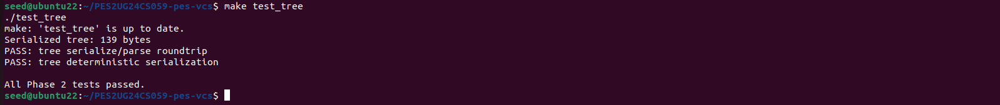

**Screenshot 2B — `xxd` of a raw tree object (first 20 lines):**

> 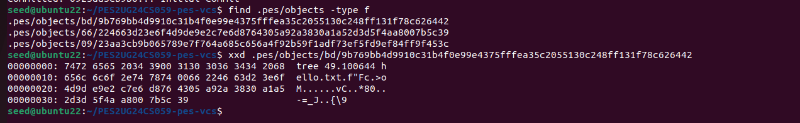

---

## Phase 3: The Index (Staging Area)

**Filesystem Concepts:** File format design, atomic writes, change detection using metadata

**Files:** `index.h` (read), `index.c` (implement all TODO functions)

### What to Implement

Open `index.c`. Three functions are marked `// TODO`:

1. **`index_load`** — Reads the text-based `.pes/index` file into an `Index` struct.
   - If the file doesn't exist, initializes an empty index (this is not an error)
   - Parses each line: `<mode> <hash-hex> <mtime> <size> <path>`

2. **`index_save`** — Writes the index atomically (temp file + rename).
   - Sorts entries by path before writing
   - Uses `fsync()` on the temp file before renaming

3. **`index_add`** — Stages a file: reads it, writes blob to object store, updates index entry.
   - Use the provided `index_find` to check for an existing entry

`index_find`, `index_status`, and `index_remove` are already implemented for you — read them to understand the index data structure before starting.

#### Expected Output of `pes status`

```
Staged changes:
  staged:     hello.txt
  staged:     src/main.c

Unstaged changes:
  modified:   README.md
  deleted:    old_file.txt

Untracked files:
  untracked:  notes.txt
```

If a section has no entries, print the header followed by `(nothing to show)`.

### Testing

```bash
make pes
./pes init
echo "hello" > file1.txt
echo "world" > file2.txt
./pes add file1.txt file2.txt
./pes status
cat .pes/index    # Human-readable text format
```

### Screenshots

**Screenshot 3A — `pes init` → `pes add` → `pes status` sequence:**

> 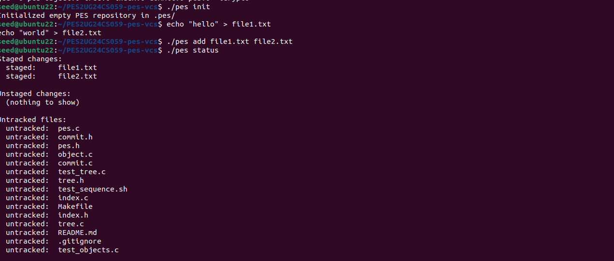

**Screenshot 3B — `cat .pes/index` showing the text-format index with entries:**

> 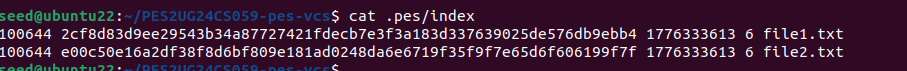

---

## Phase 4: Commits and History

**Filesystem Concepts:** Linked structures on disk, reference files, atomic pointer updates

**Files:** `commit.h` (read), `commit.c` (implement all TODO functions)

### What to Implement

Open `commit.c`. One function is marked `// TODO`:

1. **`commit_create`** — The main commit function:
   - Builds a tree from the index using `tree_from_index()` (**not** from the working directory — commits snapshot the staged state)
   - Reads current HEAD as the parent (may not exist for first commit)
   - Gets the author string from `pes_author()` (defined in `pes.h`)
   - Writes the commit object, then updates HEAD

`commit_parse`, `commit_serialize`, `commit_walk`, `head_read`, and `head_update` are already implemented — read them to understand the commit format before writing `commit_create`.

### Testing

```bash
./pes init
echo "Hello" > hello.txt
./pes add hello.txt
./pes commit -m "Initial commit"

echo "World" >> hello.txt
./pes add hello.txt
./pes commit -m "Add world"

echo "Goodbye" > bye.txt
./pes add bye.txt
./pes commit -m "Add farewell"

./pes log
```

Full integration test:

```bash
make test-integration
```

### Screenshots

**Screenshot 4A — `./pes log` showing three commits with hashes, authors, timestamps, and messages:**

>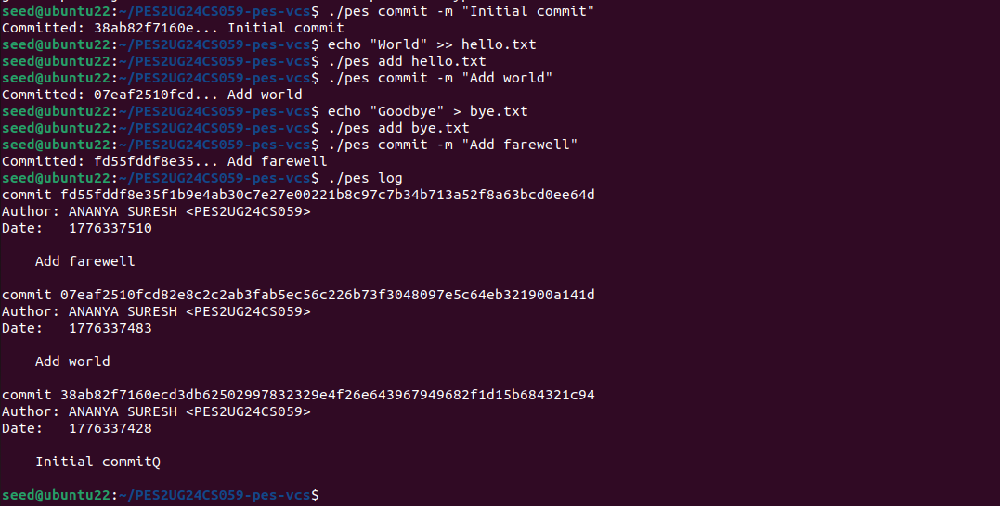

**Screenshot 4B — `find .pes -type f | sort` showing object store growth after three commits:**

>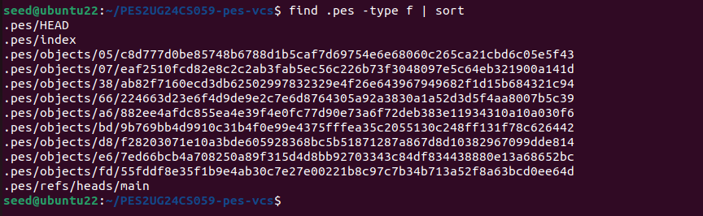
**Screenshot 4C — `cat .pes/refs/heads/main` and `cat .pes/HEAD` showing the reference chain:**

> 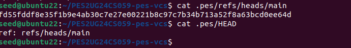

**Full Integration Test — `make test-integration` output:**

> 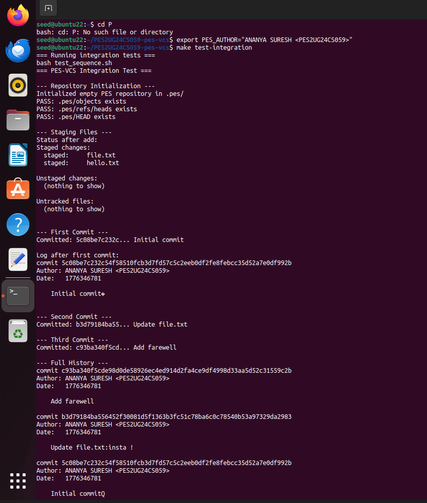


>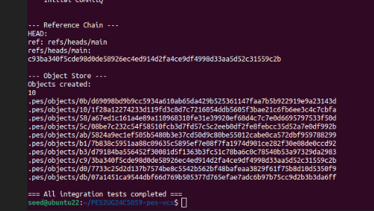

---

## Phase 5 & 6: Analysis-Only Questions

### Phase 5: Branching and Checkout

---

**Q5.1: How would you implement `pes checkout <branch>`? What files need to change in `.pes/`, and what must happen to the working directory? What makes this operation complex?**

When you run `pes checkout <branch>`, the core change inside `.pes/` is that the **HEAD file must be updated** to point to the new branch reference (e.g., `ref: refs/heads/<branch>`). This tells the system which branch is currently active.

The working directory must then be rewritten to match the snapshot of the commit that the branch points to — meaning all tracked files are replaced with the versions from that commit, new files are created, and files not present in the commit are removed.

The complexity arises because you're not just flipping a pointer: you must carefully synchronize the working directory and the staging area with the branch's commit tree, while preserving any uncommitted changes. Handling conflicts between the user's current modifications and the branch's files — deciding whether to overwrite, merge, or warn — and ensuring consistency between `.pes/index`, `.pes/HEAD`, and the working directory is what makes checkout a non-trivial operation.

---

**Q5.2: How would you detect a "dirty working directory" conflict during checkout using only the index and the object store?**

To detect a dirty working directory conflict during `pes checkout <branch>`, you rely on the **index** (which records the last staged snapshot) and the **object store** (which holds the committed trees). The process is:

1. Compare the index entries against the target branch's tree objects. For each tracked file, check whether the blob hash in the index matches the blob hash in the target branch's commit tree. If they differ, the file's content is expected to change upon checkout.

2. Compare the index entry against the actual working directory file contents. If the working file differs from the index (meaning the user has uncommitted changes), and the index also differs from the target branch's tree, you have a conflict: the checkout would overwrite the user's local modifications.

In short, the conflict is detected when a file is both **dirty** (working copy ≠ index) **and divergent** (index ≠ target branch tree). This ensures you only refuse checkout when the user's uncommitted changes would actually be lost by switching branches.

---

**Q5.3: What happens if you make commits in "detached HEAD" state? How could a user recover those commits?**

In a detached HEAD state, commits are created normally, but they are **not attached to any branch reference** — HEAD simply points to the new commit hash directly. This means the commits exist in the object store, but no branch name moves forward to track them.

If the user switches to another branch, those commits become "orphaned" and risk being lost once garbage collection runs, unless they are explicitly referenced.

To recover them, the user can:
- **Before leaving:** Create a new branch at the detached HEAD (e.g., `pes branch <name>` while still detached), so a branch pointer immediately tracks those commits.
- **After leaving:** Use the commit hash from the reflog to check out that commit and then attach it to a branch.

In short, detached HEAD commits are real and valid, but without a branch pointer they're invisible in normal workflows. Recovery relies on either saving them to a branch immediately or retrieving them via the reflog and reattaching them later.

---

### Phase 6: Garbage Collection and Space Reclamation

---

**Q6.1: Describe an algorithm to find and delete unreachable objects. What data structure would you use? For a repository with 100,000 commits and 50 branches, estimate how many objects you'd need to visit.**

To find and delete unreachable objects, you perform a **reachability analysis**:

1. Begin from all branch heads (and tags, if supported), then traverse commits transitively.
2. For each commit, mark its tree as reachable, then recursively mark all blobs referenced by that tree.
3. This is essentially a graph traversal (DFS or BFS) over the commit–tree–blob graph.
4. Once traversal is complete, any object in the object store not marked reachable is garbage and can be deleted.

The natural data structure to track reachable hashes efficiently is a **hash set** (e.g., a set keyed by object IDs). It allows O(1) average-time membership checks and insertions — crucial when dealing with hundreds of thousands of objects.

**For scale:** With 100,000 commits and 50 branches, you'd traverse nearly all 100,000 commits (since most share a single history graph). Each commit references one tree, and each tree references multiple blobs. So the traversal touches ~100,000 commits + ~100,000 trees + potentially millions of blobs depending on file churn. In practice, you'd expect to visit **on the order of hundreds of thousands to a few million objects**. The number of objects visited scales with the total history, not just the number of branches, because branches share most of their ancestry.

---

**Q6.2: Why is it dangerous to run garbage collection concurrently with a commit? Describe the race condition. How does Git's real GC avoid it?**

Running garbage collection at the same time as a commit is dangerous because both operations manipulate the object store. Consider this race condition:

1. GC scans the object store and finds a commit object that is **not yet referenced by any branch** — and marks it for deletion.
2. Concurrently, a commit operation is in the process of writing a new commit that **will** reference that object (e.g., as a parent or tree).
3. If GC deletes the object before the commit finishes, the new commit ends up pointing to a missing object, **corrupting the repository**.

Git avoids this by effectively making GC a **stop-the-world operation** — it does not run concurrently with writes. Git uses locks (like `.git/objects/pack/pack.lock` and `.git/gc.log`) to ensure exclusivity. Additionally, Git relies on the **reflog** to keep recent commits reachable even if no branch currently points to them. This preserves objects that might soon be referenced by new commits, preventing the race condition where GC deletes something a concurrent commit is about to use.

---

## Submission Checklist

### Screenshots Required

| Phase | ID | What to Capture | Status |
|-------|----|-----------------|--------|
| 1 | 1A | `./test_objects` output showing all tests passing | ⬜ |
| 1 | 1B | `find .pes/objects -type f` showing sharded directory structure | ⬜ |
| 2 | 2A | `./test_tree` output showing all tests passing | ⬜ |
| 2 | 2B | `xxd` of a raw tree object (first 20 lines) | ⬜ |
| 3 | 3A | `pes init` → `pes add` → `pes status` sequence | ⬜ |
| 3 | 3B | `cat .pes/index` showing the text-format index | ⬜ |
| 4 | 4A | `pes log` output with three commits | ⬜ |
| 4 | 4B | `find .pes -type f \| sort` showing object growth | ⬜ |
| 4 | 4C | `cat .pes/refs/heads/main` and `cat .pes/HEAD` | ⬜ |
| Final | -- | Full integration test (`make test-integration`) | ⬜ |

### Code Files Required

| File | Description |
|------|-------------|
| `object.c` | Object store implementation |
| `tree.c` | Tree serialization and construction |
| `index.c` | Staging area implementation |
| `commit.c` | Commit creation and history walking |

### Analysis Questions

| Section | Questions | Status |
|---------|-----------|--------|
| Branching (analysis-only) | Q5.1, Q5.2, Q5.3 | ✅ Answered above |
| GC (analysis-only) | Q6.1, Q6.2 | ✅ Answered above |

---

## Submission Requirements

**1. GitHub Repository**
- Submit the link to your GitHub repository via the official submission link shared by your faculty.
- The repository must strictly maintain the directory structure built throughout this lab.
- Ensure your GitHub repository is made **public**.

**2. Lab Report**
- Your report containing all required screenshots and answers to analysis questions must be placed at the **root** of your repository directory.
- The report must be submitted as either a PDF (`report.pdf`) or a Markdown file (`README.md`).

**3. Commit History (Graded Requirement)**
- **Minimum Requirement:** You must have a minimum of **5 commits per phase** with appropriate commit messages.
- **Best Practices:** Granular commits that clearly show the delta in code changes allow verification of step-by-step understanding of concepts.

---

## Further Reading

- **Git Internals** (Pro Git book): https://git-scm.com/book/en/v2/Git-Internals-Plumbing-and-Porcelain
- **Git from the inside out**: https://codewords.recurse.com/issues/two/git-from-the-inside-out
- **The Git Parable**: https://tom.preston-werner.com/2009/05/19/the-git-parable.html
